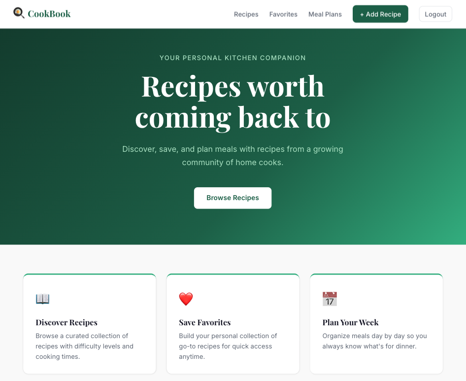
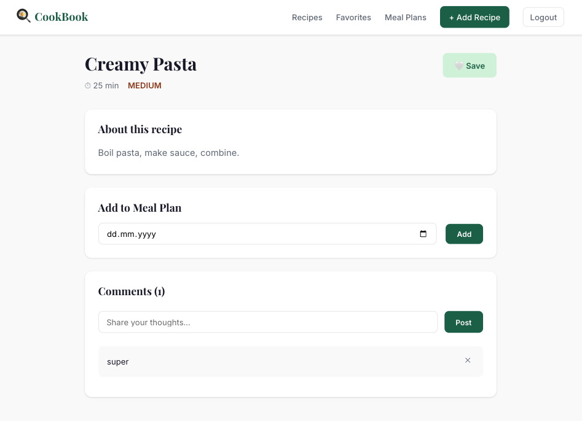

# 🍳 CookBook — Recipe Sharing & Meal Planning

A full-stack web application for discovering, sharing, and planning meals. Built with FastAPI, PostgreSQL, and React.

## Screenshots



## Features

- **Authentication** — JWT-based register and login
- **Recipes** — Create, browse, edit, and delete recipes with difficulty levels and cooking times
- **Favorites** — Save recipes to a personal collection
- **Meal Planning** — Assign recipes to specific dates
- **Comments** — Leave feedback on any recipe
- **Search & Filter** — Filter recipes by title, difficulty, and cooking time

## Tech Stack

**Backend**
- Python 3.14 + FastAPI
- PostgreSQL + SQLAlchemy ORM
- JWT Authentication (python-jose + passlib/bcrypt)
- Pydantic for data validation

**Frontend**
- React (Create React App)
- React Router v6
- Context API for auth state
- Vanilla CSS with CSS variables

## Project Structure

```
cookBook/
├── backend/
│   ├── routers/
│   │   ├── auth.py        # Register, login, /users/me
│   │   ├── recipes.py     # Recipe CRUD
│   │   ├── comments.py    # Comments per recipe
│   │   ├── favorites.py   # Favorite recipes
│   │   └── mealplans.py   # Meal planning
│   ├── models.py          # SQLAlchemy models
│   ├── schemas.py         # Pydantic schemas
│   ├── auth.py            # JWT logic, password hashing
│   ├── database.py        # DB connection
│   └── main.py            # App entry point
└── frontend/
    ├── src/
    │   ├── context/       # Auth context
    │   ├── pages/         # Page components
    │   ├── components/    # Reusable components
    │   └── services/      # API layer
    └── public/
```

## Getting Started

### Prerequisites

- Python 3.10+
- Node.js 18+
- PostgreSQL

### Backend Setup

```bash
cd backend
python3 -m venv env
source env/bin/activate
pip install -r requirements.txt
```

Create a `.env` file in the `backend/` directory:

```
SECRET_KEY=your_secret_key_here
```

Generate a secret key with:

```bash
openssl rand -hex 32
```

Create the database in PostgreSQL:

```sql
CREATE DATABASE cookbook;
```

Start the backend:

```bash
uvicorn main:app --reload
```

API docs available at `http://localhost:8000/docs`

### Frontend Setup

```bash
cd frontend
npm install
npm start
```

Frontend runs at `http://localhost:3000`

## API Endpoints

| Method | Endpoint | Auth | Description |
|--------|----------|------|-------------|
| POST | `/register/` | No | Register a new user |
| POST | `/token/` | No | Login and get JWT token |
| GET | `/users/me/` | Yes | Get current user |
| GET | `/recipes/` | No | List all recipes |
| POST | `/recipes/` | Yes | Create a recipe |
| GET | `/recipes/{id}` | No | Get a recipe |
| PUT | `/recipes/{id}` | Yes | Update a recipe (author only) |
| DELETE | `/recipes/{id}` | Yes | Delete a recipe (author only) |
| GET | `/recipes/{id}/comments/` | No | List comments |
| POST | `/recipes/{id}/comments/` | Yes | Add a comment |
| DELETE | `/recipes/{id}/comments/{id}` | Yes | Delete a comment |
| GET | `/favoriterecipes/` | Yes | List favorites |
| POST | `/favoriterecipes/` | Yes | Add to favorites |
| DELETE | `/favoriterecipes/{id}` | Yes | Remove from favorites |
| GET | `/mealplans/` | Yes | List meal plans |
| POST | `/mealplans/` | Yes | Add meal plan |
| DELETE | `/mealplans/{id}` | Yes | Remove meal plan |

## Database Schema

```
Users ──< Recipes ──< Comments
      ──< FavoriteRecipes
      ──< MealPlans
Recipes ──< Ingredients
```
